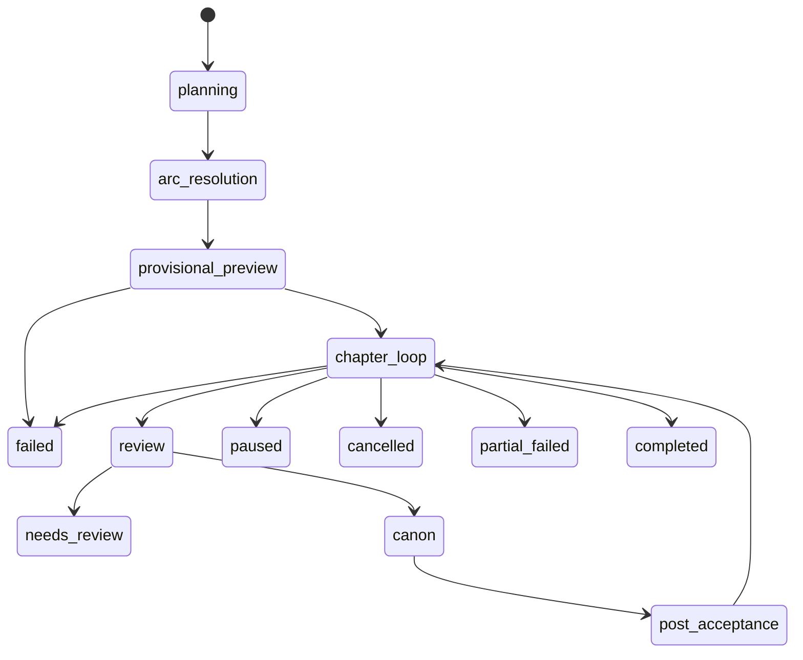

# ForWin 总规划与当前完成度

更新时间：2026-04-17

## 1. 文档目的

这份文档把三条设计线收束成一个统一规划：

- `v2.3` 的 Writer 主链，重点是 `2.3 正式 Writer 生成流程`、`2.6 output limit 策略`、`2.7 scene 兼容的 WriterOutput`
- `v2.6` 的评论反馈分阶段落地路线
- `v2.7` 的网文体验层、证据锚定 reviewer、experience overlay

本文档回答四个问题：

1. 本项目现在到底在做什么
2. 设计上的总路线应该怎么表述
3. 按当前代码实现，已经做到什么程度
4. 当前真实状态机和产品能力边界是什么

说明：

- 本文档是“总规划 + 当前实现盘点”，不是新的架构提案。
- 写作任务的细状态以 [writing_flow_state_machine.md](/home/taiwei/ForWin/Design-docs/writing_flow_state_machine.md:1) 为准。
- provisional 的位置和语义以 [provisional_mechanism_check.md](/home/taiwei/ForWin/Design-docs/provisional_mechanism_check.md:1) 的核对结论为准。

## 2. 一句话定义项目

ForWin 当前可以定义为：

> 一个面向长篇连载网文的自动化写作系统。它以 `Arc -> Band -> Chapter` 的规划骨架驱动章节生产，用 `scene-aware Writer + review/rewrite + canon state update + audience feedback + experience overlay` 形成闭环，并支持 `blackbox / copilot / checkpoint` 三种运行模式。

## 3. 总规划

### 3.1 总体架构

统一后的总路线不是三套并列系统，而是一条主链上分层增强：

1. `v2.3` 提供主生产链
   - 负责从计划到正文、从正文到结构化产物、从结构化产物到 canon 的闭环。
   - 解决“怎么稳定写出来、怎么抗错、怎么恢复、怎么多项目并行”的问题。

2. `v2.6` 提供外部反馈校准层
   - 负责把评论/读者反馈压缩成可聚合、可量化、可节制注入的信号。
   - 解决“系统怎么知道读者觉得拖、乱、热度变化、风险上升”的问题。

3. `v2.7` 提供网文体验规划与审查层
   - 负责把“这章应该给什么体验、实际交付了什么体验、为什么 fail/warn”系统化。
   - 解决“系统不只写得通，还要写得像网文、读者想继续看”的问题。

因此总规划可以表述成：

> `v2.3` 是生产主链，`v2.6` 是反馈校准层，`v2.7` 是体验规划与体验审查层。三者叠加后，形成“计划 -> 预演 -> 写作 -> 审查 -> canon -> 后分析 -> 反馈校准 -> 下一轮计划”的闭环。

### 3.2 统一目标

项目的统一目标不是“做一个能吐章节的 Writer”，而是分六层完成：

1. 长篇规划层
   - 书级目标、arc 结构、band 执行单元、chapter 计划。

2. 写作生成层
   - scene 级拆分、正文生成、拼接、结构化抽取、失败恢复。

3. 状态回写层
   - entities / events / threads / timeline / canon 的持久化。

4. 审查翻工层
   - continuity review、WNER、lint signal、rewrite loop、人工 review checkpoint。

5. 反馈校准层
   - 评论信号提取、窗口聚合、reader tier、trend、hint/action mapping。

6. 运维控制层
   - pause / continue / terminate、模型 fallback、任务可视化、失败原因可见、可恢复执行。

## 4. 项目功能与特性

### 4.1 当前已经具备的核心功能

1. 多层规划
   - 已有 `Arc -> Band -> Chapter` 的规划与派生链。
   - band 级 provisional 预演会在正式 canon 前执行。

2. scene-aware Writer
   - 支持 scene breakdown、scene generation、scene stitch。
   - 支持 single 模式兜底。
   - Writer 输出已经带 `scene_outputs / state_changes / new_events / thread_beats / time_advance / generation_meta`。

3. 审查与自动翻工
   - 每章自动 review。
   - reviewer 由 `continuity + WNER + lint signals` 聚合。
   - fail 后可按 `scene -> band -> arc` 升级 repair scope 重写。

4. canon 与世界状态维护
   - accepted 章节会回写实体状态、事件、threads、timeline。
   - phase3/phase4 在接受后做 stage/pacing/world pressure/NPC intents/feedback aggregation。

5. 读者反馈闭环
   - 已有评论信号提取、窗口聚合、reader scale、reader tier、trend、ActionMapper、AudienceHintPack。
   - audience signals 已部分接入 pacing 和 phase24 校准。

6. 体验层
   - 已有 `ReaderPromise / ArcPayoffMap / BandDelightSchedule / ChapterExperiencePlan`。
   - 已有 trope template registry、band experience override API、ReviewContextPack、evidence-anchored review detail API。

7. 运行控制
   - 支持 `blackbox / copilot / checkpoint` 三模式。
   - 支持安全暂停、继续生成、人工 review 后继续。
   - 支持 LLM 单模型 retry 用尽后跨 profile fallback。

8. 前端任务管理
   - 书本详情页已按状态机展示任务驾驶舱。
   - 失败原因、review 详情、暂停状态、下一步动作可见。

### 4.2 当前产品特性

- 长篇导向，不是一次性短篇生成器。
- 以状态和计划驱动，不以“全文 prompt 一把梭”驱动。
- 默认允许黑箱运行，但保留人工 checkpoint 和 co-pilot 控制。
- 审查不只看文法，也看 continuity 和网文体验。
- audience feedback 不直接改 canon，只作为校准信号。
- provisional 是正式写作前的闸门，不是另起一套正文宇宙。
- 世界状态是 append-only 快照链，不是单个大 JSON 覆盖。

## 5. 当前完成度评估

下面的完成度是 2026-04-17 基于当前代码的工程判断，不是测试覆盖率。

| 模块 | 目标 | 当前完成度 | 判断 |
| --- | --- | --- | --- |
| `v2.3 Writer 主链` | scene 化写作、output limit 控制、结构化输出、模式化运行 | `80%` | 主链已成型，但仍缺少 scene continuation、lore/timeline hints/writer notes 等完整 contract |
| `canon / 世界状态` | accepted 后稳定回写实体、事件、线程、时间线 | `85%` | 基础账本完整，已可支撑连续写作 |
| `phase3 / phase4 后分析` | pacing、stage、world pressure、NPC intents、feedback aggregation | `75%` | 已接入主链，但更偏后分析层，尚未成为更强的计划驱动核心 |
| `v2.6 反馈层` | Phase A/B/C 三阶段完整落地 | `80%` | 候选信号、窗口聚合、reader scale、trend、action/hints、score_v1 基本都已存在 |
| `v2.7 体验层` | overlay + WNER + repair + lint + trope registry + 7C 校准 | `72%` | 主骨架已接好，但 reviewer context 与 audience/experience 的完全联动还未彻底闭合 |
| `任务状态机与恢复` | pause/continue/review gate/fallback/UI 可见性 | `88%` | 已能实用，但容器级重启仍会中断进程内任务 |
| `前端任务管理` | 按真实状态机展示、失败可诊断、操作可解释 | `82%` | 最近一轮已明显完善，仍可继续压缩认知负担 |

### 5.1 v2.3 对照结果

#### 已完成

- scene breakdown / scene generation / stitch 主链已存在
- 默认 chapter 长度与 scene 数控制已存在
- scene 模式失败后可回退 single 模式
- WriterOutput 已为 scene 模式保留 `scene_outputs`
- structured extraction 已覆盖 `state_changes / events / thread_beats / time_advance`

#### 部分完成

- output limit 的主策略已经是“优先 scene 拆分”
- stitch pass 已是轻量拼接，不是整章重写
- Writer 已有 `generation_meta`，可记录调用模式和 fallback

#### 尚未完成或未完全对齐

- 没有显式 `scene continuation`
- `WriterOutput` 里还没有 `lore_candidates`
- `WriterOutput` 里还没有 `timeline_hints`
- `WriterOutput` 里还没有 `writer_notes`
- 当前 structured extraction 仍偏最小闭环，不是 v2.3 规划中的完整抽取面

### 5.2 v2.6 对照结果

#### 已完成

- `CommentSignalCandidate`
- `SignalWindowAggregate`
- `ReaderScaleSnapshot`
- six-type schema 预留
- trend 派生
- `score_v1`
- `ActionMapper`
- `AudienceHintPack`
- audience signal 对 pacing / phase24 的部分接入

#### 当前评价

如果按 v2.6 phased rollout 来看，项目不是停在 Phase A/B，而是已经把 A/B/C 的主骨架都做出来了。

#### 仍需补强

- 读者反馈对所有关键导演模块的接入还不够均衡
- Writer 侧虽然通过 hint 间接受益，但“基于 audience 的行为变化”仍然偏保守
- 真实平台数据与 reader estimate 的校准仍然偏代理层

### 5.3 v2.7 对照结果

#### 已完成

- experience overlay 四件套
- trope template seed registry
- ReviewContextPack
- WNER LLM-first + heuristic fallback
- evidence-anchored review detail
- lint signal collector
- merged repair instruction
- `scene -> band -> arc` repair 升级链
- API 支持查看 review、approve、override band experience

#### 当前评价

v2.7 已经不是“字段占位”，而是已经进入可运行阶段。

#### 仍需补强

- reviewer context 还没有把 `confirmed_signals` 显式纳入协议对象
- trope library 目前还是 starter pack，不是完整运营级库
- 7C 校准虽然有接入，但还不是强约束驱动
- WNER 的一些判断仍保留较多 heuristic 成分，不是完全由稳定证据框架主导

## 6. 当前真实状态机

完整版本见 [writing_flow_state_machine.md](/home/taiwei/ForWin/Design-docs/writing_flow_state_machine.md:1)。这里给出统一抽象版。

### 6.1 宏观状态机

### 6.2 任务级状态

- `starting`
  - 任务已创建，worker 准备启动。

- `running`
  - 正在规划、预演、写章、review、canon 或 post-acceptance。

- `needs_review`
  - 章节进入人工 review checkpoint。

- `paused`
  - 安全暂停；可以继续。

- `cancelled`
  - 强制终止；不用于继续。

- `failed`
  - 本次没有 accepted 章节，且失败结束。

- `partial_failed`
  - 有 accepted 章节，也有 failed 章节。

- `completed`
  - 本次选择的章节全部完成。

### 6.3 单章流水线

1. `assembling_context`
2. `writing_chapter`
3. `continuity_review`
4. `paused_for_review` 或 `applying_canon`
5. `running_post_acceptance`
6. `accepted`

### 6.4 当前状态机的关键语义

1. provisional 是 band 级闸门
   - 不是整本书只跑一次
   - 也不是每章单独顶层双写

2. review 是每章自动 review
   - 不是每个 band 才 review 一次
   - 人工 review checkpoint 由模式和 `review_interval_chapters` 决定

3. continue-generation 的语义是“补跑剩余章节”
   - 只跑 `planned / failed`
   - 不重写 `accepted`
   - 有真实 `needs_review` 会拒绝继续

4. pause 是安全暂停
   - 不打断正在进行的 LLM request
   - 只在 checkpoint 落停

5. 当前章节失败不一定阻断后续章节
   - 对非 transient 失败，后续章节可能继续写
   - 这意味着系统当前不是严格前序依赖锁

## 7. 当前项目的能力边界

### 7.1 现在已经可以自洽完成的事

- 从书级计划自动生成多章正文
- 维护连续的 canon/world state
- 在自动 review 后决定接受、暂停或重写
- 按 band 做 provisional 预演并阻断明显有问题的后续推进
- 通过 audience feedback 和 experience overlay 对下一轮计划做校准
- 通过 pause / continue / review approve 维持较稳定的长任务执行

### 7.2 当前仍然是边界或风险的点

- 严格的“前序章节未完成则后章绝不继续”还没有被系统强约束
- phase3/phase4 更像后分析层，不是更强的世界模拟内核
- 容器重启仍会中断进程内任务，pause 只是应用级安全协议
- WriterOutput contract 还没扩到 v2.3 设想的完整 scene-era 版本
- v2.7 的体验校准仍处在“可运行但未完全闭环”的阶段

## 8. 推荐的后续总规划

### P0：把 v2.3 主链补完整

- 补 `scene continuation`
- 扩 WriterOutput：`lore_candidates / timeline_hints / writer_notes`
- 把 structured extraction 从“闭环够用”补到“scene-era 完整 contract”

### P1：把章节依赖和 continue 语义收紧

- 明确失败章节对后续章节的阻断策略
- 明确 continue 是“补洞”还是“局部重排后补写”
- 如果继续允许跳章完成，前端必须显式提示连续性风险

### P2：让 phase3/phase4 更像真正的导演后处理

- 让 stage/pacing/world pressure 更强地回流到下一 band/arc 决策
- 弱化“仅摘要”的角色，增强“有动作的分析层”

### P3：把 v2.7 reviewer 闭环补齐

- ReviewContextPack 显式纳入 confirmed signals
- 让 WNER 的 audience confirmation 与 overlay patch 更一致
- 继续把 lint / canon evidence / recent review notes 真正收束到证据框架

### P4：把运维和前端再压实

- 把失败原因持久化得更稳定
- 把“下一步该做什么”尽量在 UI 中自动解释
- 在部署层避免运行任务与容器切换直接冲突

## 9. 最终结论

当前项目已经不是“一个 Writer 原型”，而是一个已经具备生产链、审查链、状态链、反馈链和运维控制链的长篇连载系统雏形。

最准确的判断是：

- `v2.3` 主链已经可运行，但还没补完所有 scene-era contract
- `v2.6` 已经超出 phased rollout 早期阶段，A/B/C 主骨架基本都在
- `v2.7` 已进入可运行阶段，但仍需要补强 reviewer 闭环和体验校准闭环

如果用一句话概括当前阶段：

> ForWin 现在处在“主链已经跑通，体验层和反馈层已经接上，但还需要从可运行系统继续收敛成强约束、强闭环、强可维护系统”的阶段。
