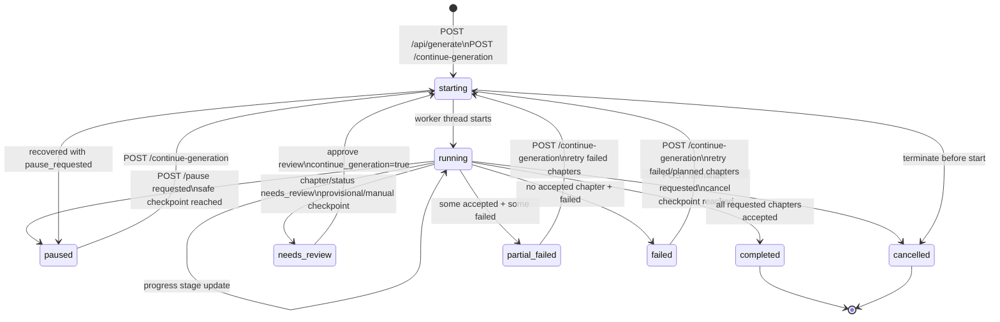
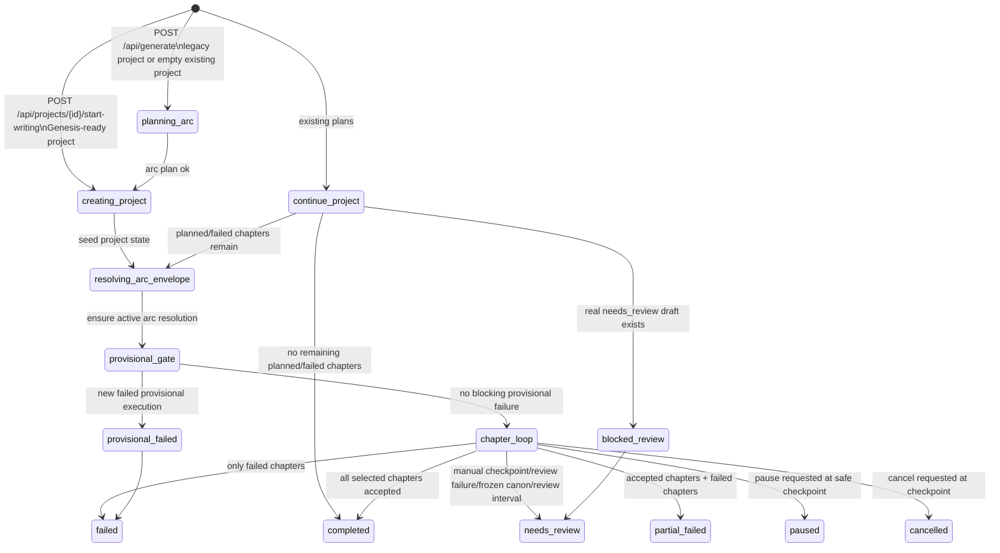
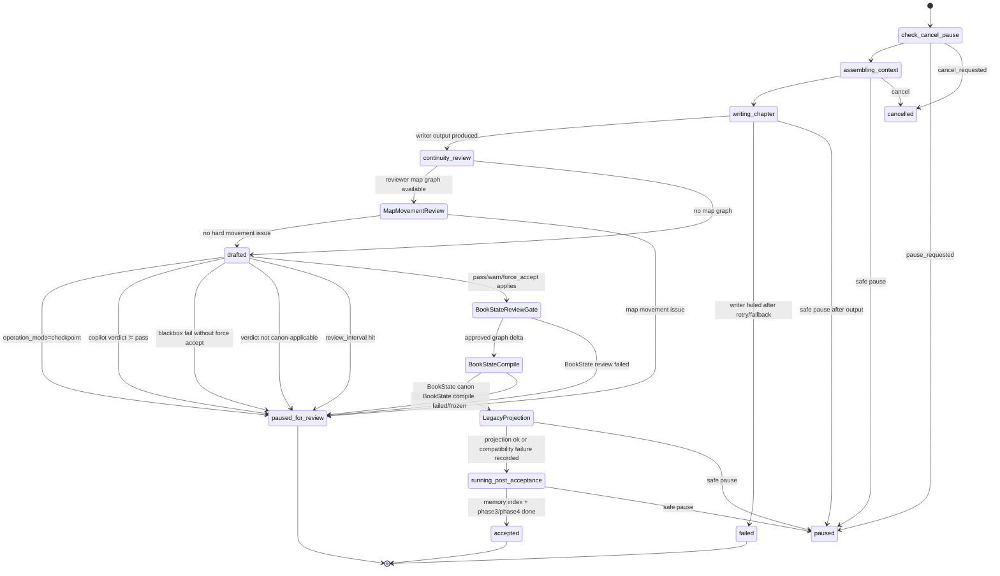
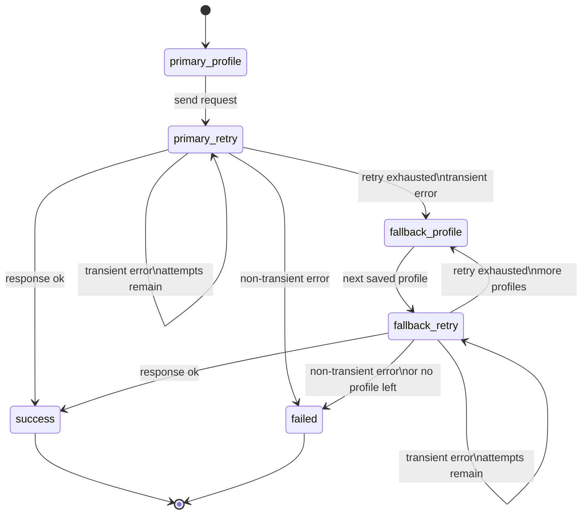

# 写作流程状态机

更新时间：2026-04-26

本文档描述当前代码里的**写作任务**状态机。范围包括 API 任务状态、`start-writing` 之后的 orchestrator 主流程、单章流水线、人工 review/continue、安全暂停/强制终止，以及 LLM retry/fallback。

V4.5.1 只在本文档维护后端主链节点：`MapMovementReview`、`BookStateReviewGate`、`BookStateCompile`、`LegacyProjection`。World Studio、dashboard、脚本型 Skill runtime 的产品/UI 状态图归入 V4.6+，不写入本文档。

`V2.9.2` 起，“创建书本”已经前移为 Genesis Workflow；Genesis 本身不属于本文档的写作任务状态机。  
本文档只描述：

- `POST /api/generate`
- `POST /api/projects/{project_id}/start-writing`
- `POST /continue-generation`

进入正式写作任务后的状态机。

## 图形版

### 1. API 任务状态机

终态集合：`completed`、`partial_failed`、`failed`、`needs_review`、`cancelled`、`paused`。

### 2. Orchestrator 主流程

### 3. 单章流水线

### 4. LLM request retry/fallback

跨模型 fallback 只发生在当前 profile 的单模型 retry 全部耗尽之后。只对 transient 错误 fallback，包括 `429`、`5xx`、`529`、timeout、network disconnect、connection reset 等。不对 `400`、鉴权失败、prompt/schema/JSON 解析失败、内容质量失败、review fail 做跨模型 fallback。

## 文字版

### 任务级状态

`starting`

任务记录已创建，worker thread 准备运行。入口包括新生成任务和继续生成任务。

`running`

worker 已开始推进。API 层会根据 progress stage 更新 `current_stage`、`current_chapter`、`completed_chapters`、`failed_chapters`、`paused_chapters`。

`paused`

安全暂停终态。用户调用 pause 后只设置 `pause_requested`，不会中断正在进行的 HTTP request；orchestrator 在安全 checkpoint 检测到后返回 `RunResult(paused=True)`，任务进入 `paused`。可通过 continue 从未完成章节继续。

`needs_review`

人工 review checkpoint。触发来源包括 checkpoint 模式、copilot 模式非 pass、blackbox fail 且未 force accept、canon 写入冻结、周期性 `review_interval_chapters`。存在 `needs_review` 章节时，continue API 会拒绝继续，要求先 approve review。

`cancelled`

强制终止终态。用户调用 terminate 后设置 `cancel_requested`，orchestrator 在 checkpoint 检测到后返回 cancelled。与 pause 不同，cancelled 不用于继续。

`failed`

没有任何 accepted 章节，且出现 failed 章节或 provisional gate 失败。

`partial_failed`

至少有 accepted 章节，同时存在 failed 章节。

`completed`

本次选择的章节全部接受并完成后置处理。

### 主流程

1. 旧式新建生成或空项目仍可进入 `planning_arc`，调用 arc director 生成 arc plan。
2. `V2.9.2` 新项目默认先走 Genesis；显式 `start-writing` 后直接进入 `creating_project`，从 Genesis blueprint materialize arc 骨架，并只为当前 active arc 生成 `ChapterPlan`。
3. `creating_project` 创建或更新 project，写入初始 state、arc skeleton、当前 active arc 的 chapter plans、entities、threads。
4. `resolving_arc_envelope` 保证 active arc resolution 存在。
5. provisional gate 检查最近一次 provisional execution；如果出现新的 failed provisional execution，相关章节标记 failed，任务结束为 failed。
6. 进入 chapter loop，按章节依次执行单章流水线。
7. 如果是继续生成，先加载已有 chapter plans；真实 `needs_review` 章节会阻塞继续，没有 draft 的孤儿 `needs_review` 会重置回 `planned`。
8. continue 只选择当前 active arc 的 `planned` 和 `failed` 章节，不重写 accepted 章节；若当前 arc 已无 pending work，系统可先 materialize 下一条 planned arc。

### 单章流程

1. 每章开始先检查 cancel 和 pause。
2. `assembling_context` 组装章节上下文。
3. `writing_chapter` 调 writer。writer 内部会按单模型 retry，必要时由 LLMClient 做跨 profile fallback。
4. writer 失败后尝试 preview fallback；仍失败则章节标为 failed。
5. `continuity_review` 调 HistoricalReviewHub/ContinuityChecker，保存 draft 和 review；若 reviewer map graph 可用，进入 `MapMovementReview`，检查 objective path、observer-known path、hidden/blocked/false route、access rule 和 speed policy。
6. 根据 operation mode 和 verdict 判断：
   - `checkpoint`：总是 `needs_review`。
   - `copilot`：`pass` 才继续，`warn/fail` 进入 `needs_review`。
   - `blackbox`：`fail` 且没有 force accept 时进入 `needs_review`；`pass/warn/force_accept` 可进入 canon。
7. 如果 `review_interval_chapters > 0` 且当前章节命中周期，并且不是本次最后一章，在 canon 前把当前章标为 `needs_review`。
8. `BookStateReviewGate` 对 adapter 生成的 `ApprovedGraphDeltaSet` 做 deterministic guardrail；失败进入 `needs_review`。
9. `BookStateCompile` 优先提交 BookState canon、snapshot 与 replay ledger；失败且允许 freeze 时冻结候选并进入 `needs_review`。
10. `LegacyProjection` 只做旧 `world_model_v4` compatibility projection；projection failure 写入 DecisionEvent，不覆盖已提交的 BookState canon。
11. `running_post_acceptance` 更新 memory index，并执行 phase3/phase4 后置处理。
12. 章节标记为 `accepted`，加入 `completed_chapters`。

### Pause / Continue

Pause 是安全暂停：

1. `POST /api/tasks/{task_id}/pause` 只设置 `pause_requested=True`。
2. `_update_task` 会阻止旧的 running/stage 更新覆盖暂停意图。
3. Orchestrator 在章节边界、context 后、writer 后、review 后、canon 后、post-acceptance 后检查 pause。
4. 检测到 pause 后返回 `paused`，不会把当前未接受章节误标为 accepted。

Continue 的规则：

1. `POST /api/projects/{project_id}/continue-generation` 从已有 project 继续。
2. 如果存在真实 `needs_review`，返回 409，要求先人工处理。
3. 只运行 `planned` 和 `failed` 章节。
4. 已 `accepted` 章节不会重写。
5. 任务启动时冻结 runtime config 和 fallback profile 列表，运行中修改配置不影响已启动任务。

### Review / Approve

1. `GET /api/projects/{project_id}/chapters/{chapter_number}/review` 读取最新 draft 对应 review。
2. `POST /review/approve` 调 `accept_review`，将 draft 写入 canon，章节改为 `accepted`。
3. 如果请求 `continue_generation=true`，approve 后创建 continue task，继续剩余 `planned/failed` 章节。

### 状态来源

核心代码位置：

1. API 任务终态和 stage 映射：`forwin/api.py`
2. progress stage 到任务 status 的映射：`forwin/api_runtime.py`
3. orchestrator run/continue/chapter loop：`forwin/orchestrator/loop.py`
4. review 字数检查：`forwin/checker/rules.py`
5. LLM retry/fallback：`forwin/writer/llm_client.py`
